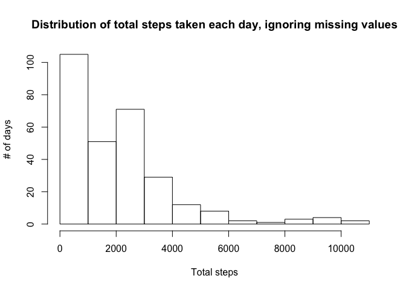
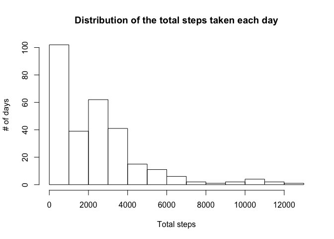
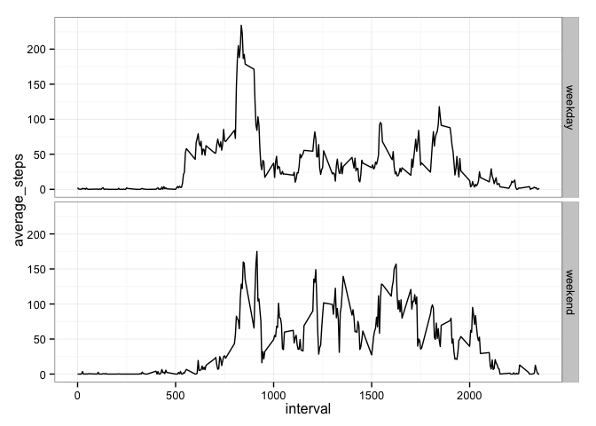

# Reproducible Research: Peer Assessment 1


## Loading and preprocessing the data

```r
data <- read.table(unz("activity.zip", "activity.csv"), sep=",", quote="\"", header=TRUE)
data$date <- as.Date(data$date)
```

## What is mean total number of steps taken per day?

```r
library(dplyr)
```

```
## 
## Attaching package: 'dplyr'
## 
## The following object is masked from 'package:stats':
## 
##     filter
## 
## The following objects are masked from 'package:base':
## 
##     intersect, setdiff, setequal, union
```

Sum up the total steps taken each day:

```r
splits <- group_by(data, interval)
daily <- summarize(splits, total_steps=sum(steps, na.rm=TRUE))
hist(daily$total_steps,
     main="Distribution of total steps taken each day, ignoring missing values",
     xlab="Total steps",
     ylab="# of days")
```

 

```r
mean(daily$total_steps)
```

```
## [1] 1981.278
```

```r
median(daily$total_steps)
```

```
## [1] 1808
```

## What is the average daily activity pattern?

```r
splits <- group_by(data, interval)
interval <- summarize(splits, average_steps=sum(steps, na.rm=TRUE))
plot(interval$interval,
     interval$average_steps,
     type='l',
     main="Average steps over the course of a day",
     xlab="Interval",
     ylab="Average steps")
```

 

Interval with the highest average number of steps:


```r
interval$interval[which.max(interval$average_steps)]
```

```
## [1] 835
```

## Imputing missing values
Total number of missing values in the data set:

```r
sum(is.na(data$steps))
```

```
## [1] 2304
```

Replace missing values with the average # of steps for that interval across all days:

```r
splits <- group_by(data, interval)
splits <- mutate(splits, interval_mean=mean(steps, na.rm=TRUE))
splits$steps[is.na(splits$steps)] <- splits$interval_mean[is.na(splits$steps)]
```

Sum up the total steps taken each day including the imputed values

```r
imputed_daily <- summarize(splits, total_steps=sum(steps))
```

As seen in the histogram below, imputing the missing values in this way does not change the general shape of the distribution, although it does increase the average total daily step count by about 15%.

```r
hist(imputed_daily$total_steps,
     main="Distribution of the total steps taken each day",
     xlab="Total steps",
     ylab="# of days")
```

 

```r
mean(imputed_daily$total_steps)
```

```
## [1] 2280.339
```

```r
median(imputed_daily$total_steps)
```

```
## [1] 2080.906
```

## Are there differences in activity patterns between weekdays and weekends?

```r
weekday.type <- function(date) {
  if(grepl("^S", weekdays(date))) {
    return('weekend')
  }
  return('weekday')
}
```

The weekday.type factor tells whether it was a weekday or a weekend:

```r
data$weekday.type <- factor(sapply(data$date, weekday.type))
```

Average for intervals across days, divided by weekday and weekend factor:

```r
splits <- group_by(data, interval, weekday.type)
splits <- mutate(splits, interval_mean=mean(steps, na.rm=TRUE))
splits$steps[is.na(splits$steps)] <- splits$interval_mean[is.na(splits$steps)]
interval.weekday <- summarize(splits, average_steps=mean(steps))
```

There seems to be a spike in step counts on weekdays around mid-morning that doesn't appear on the weekend.  On the weekend, the average step counts seem to be slightly higher throughout the afternoon and evening.

```r
library(ggplot2)
ggplot(interval.weekday, aes(x=interval, y=average_steps)) +
  geom_line() +
  facet_grid(weekday.type ~ .) +
  theme_bw()
```

 
